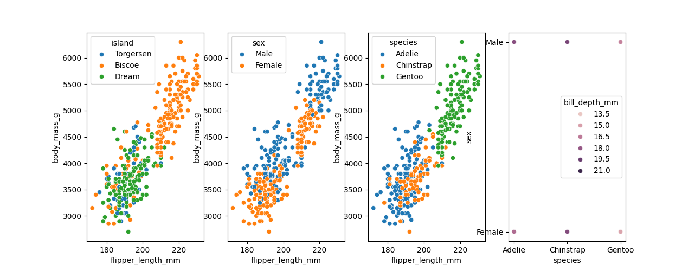
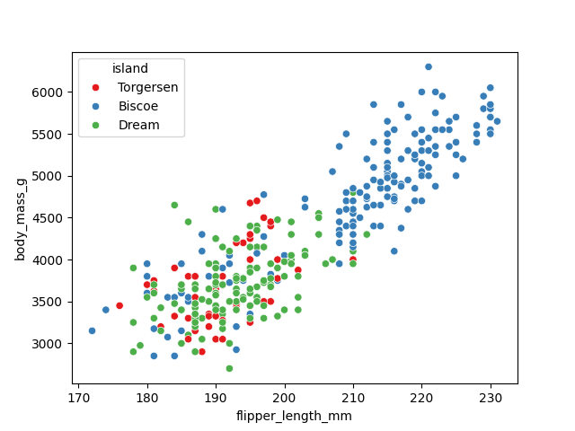
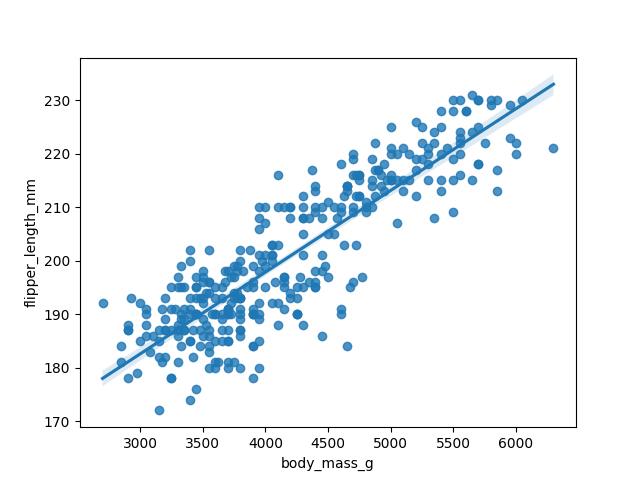
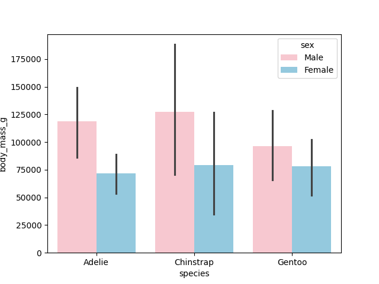
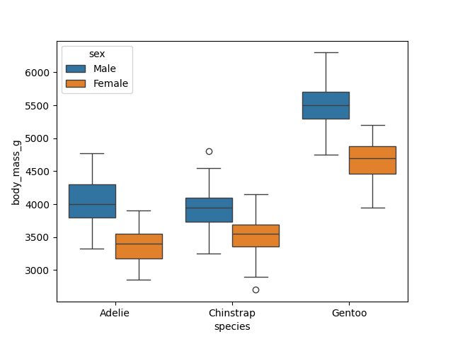
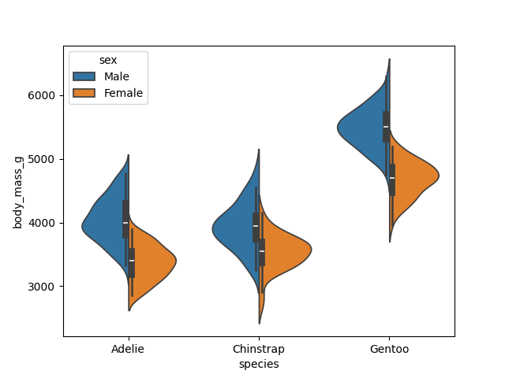
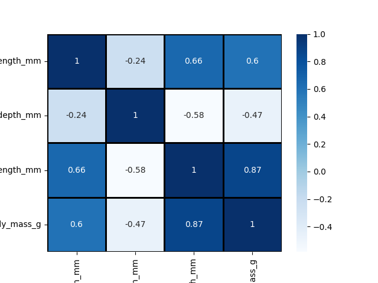
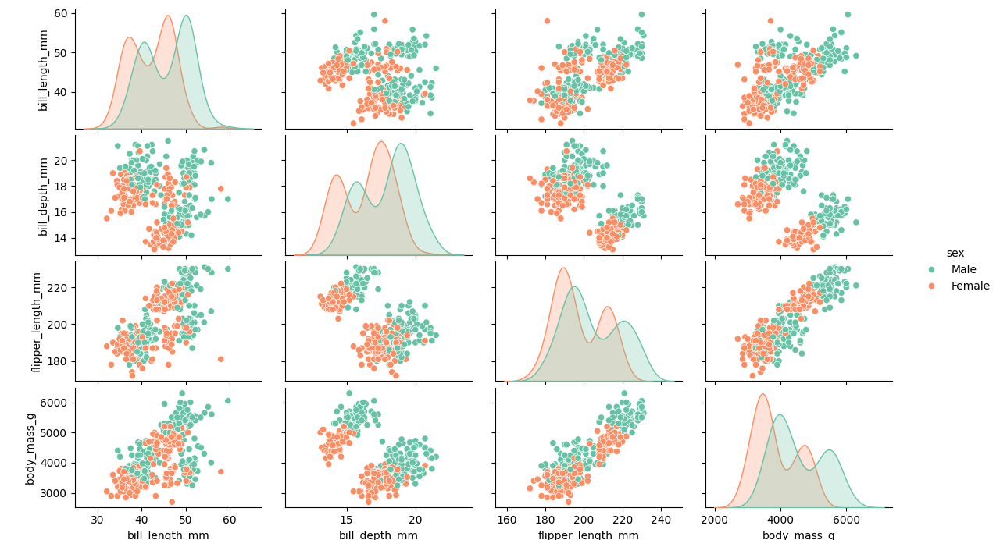
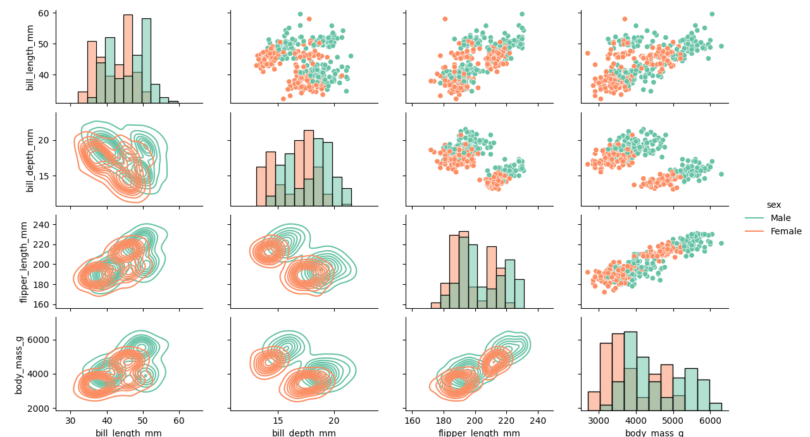

# 📊 Seaborn Essentials – Statistical Data Visualization in Python


---

# 📖 Project Overview

This repository documents my hands-on learning journey with **Seaborn**, a powerful Python data visualization library built on top of Matplotlib.

Using Seaborn's built-in **Penguins dataset**, I explored a wide range of visualization techniques to understand relationships, distributions, trends, and correlations within data. Each Python script focuses on a specific visualization concept, making this repository a structured learning resource as well as a portfolio showcasing my data visualization skills.

The repository contains **21 visualization examples**, progressing from basic scatter plots to advanced statistical visualizations such as PairGrid and Correlation Heatmaps.

---

# 📚 Topics Covered

* Introduction to Seaborn
* Multiple Scatter Plots
* Scatter Plot
* Themes & Styles
* Context Customization
* Color Palettes
* Strip Plot
* Swarm Plot
* Histogram
* Histogram Variations
* Regression Plot
* Line Plot
* Joint Plot
* Bar Plot
* Count Plot
* Box Plot
* Violin Plot
* Violin Plot with Swarm Plot
* KDE Plot
* Correlation Heatmap
* Rug Plot
* Pair Plot
* PairGrid

---

# 🛠️ Seaborn Functions Used

* `sns.load_dataset()`
* `sns.scatterplot()`
* `sns.lineplot()`
* `sns.regplot()`
* `sns.barplot()`
* `sns.countplot()`
* `sns.histplot()`
* `sns.kdeplot()`
* `sns.rugplot()`
* `sns.boxplot()`
* `sns.violinplot()`
* `sns.stripplot()`
* `sns.swarmplot()`
* `sns.jointplot()`
* `sns.pairplot()`
* `sns.PairGrid()`
* `sns.heatmap()`
* `sns.set_theme()`
* `sns.set_style()`
* `sns.set_context()`

---

# 📂 Repository Structure

```text
Seaborn/
│
├── figuresSeaborn/
│   ├── figure1.png
│   ├── figure2.png
│   ├── ...
│   └── figure21.png
│
├── 00_introduction.py
├── 01_multiple_scatterplots.py
├── 02_scatterplot.py
├── 03_theme_and_context.py
├── 04_scatterplot_palette.py
├── 05_stripplot.py
├── 06_swarmplot.py
├── 07_histplot.py
├── 08_histplot_multiple.py
├── 09_regression_plot.py
├── 10_lineplot.py
├── 11_jointplot.py
├── 12_barplot.py
├── 13_countplot.py
├── 14_boxplot.py
├── 15_violinplot.py
├── 16_violin_swarmplot.py
├── 17_kdeplot.py
├── 18_correlation_heatmap.py
├── 19_rugplot.py
├── 20_pairplot.py
├── 21_pairgrid.py
│
└── README.md
```

---

# 📸 Visualization Gallery

## 📊 Figure 1 – Multiple Scatter Plots



---

## 🎨 Figure 4 – Scatter Plot with Color Palette



---

## 📈 Figure 9 – Regression Plot



---

## 📉 Figure 12 – Bar Plot



---

## 📦 Figure 14 – Box Plot



---

## 🎻 Figure 15 – Violin Plot



---

## 🔥 Figure 18 – Correlation Heatmap



---

## 🔗 Figure 20 – Pair Plot



---

## 🧩 Figure 21 – PairGrid



---

# 💻 Skills Demonstrated

* Statistical Data Visualization
* Exploratory Data Analysis (EDA)
* Scatter Plot Analysis
* Distribution Visualization
* Correlation Analysis
* Regression Analysis
* Multi-variable Visualization
* Theme & Style Customization
* Color Palette Selection
* Plot Customization
* Data Interpretation
* Clean Python Code Organization

---

# 🎯 Learning Outcomes

Through this repository, I gained practical experience in:

* Creating professional statistical visualizations using Seaborn
* Understanding relationships between numerical and categorical variables
* Exploring data distributions through multiple visualization techniques
* Customizing plot themes, styles, and color palettes
* Visualizing trends and correlations effectively
* Building publication-quality visualizations for data analysis
* Writing clean, modular, and reusable Python code

---

# 🔮 Future Improvements

* Perform Exploratory Data Analysis (EDA) on real-world datasets
* Create interactive dashboards using Plotly
* Build Streamlit data visualization applications
* Integrate Pandas for advanced data preprocessing
* Apply Seaborn visualizations in Machine Learning workflows
* Develop business intelligence dashboards using real datasets

---

# 👩‍💻 Author

**Nithya Sree**

**Aspiring Data Scientist**

**Skills:** Python | SQL | NumPy | Pandas | Matplotlib | Seaborn | Machine Learning
